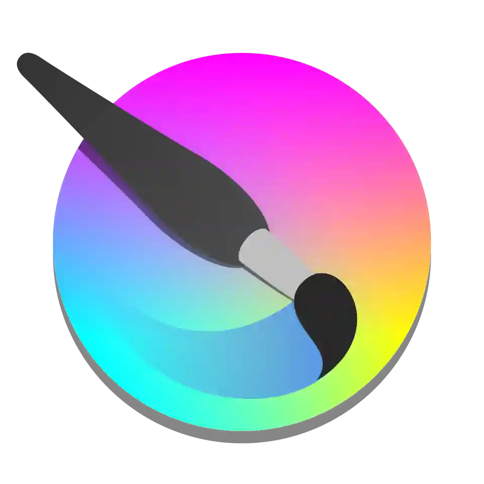

#  El Vueltero's Gallery

**El Vueltero's Gallery** es mi espacio creativo: un portafolio vivo donde conviven ilustraciones, diseños, experimentos estéticos y la evolución de mis habilidades como desarrollador frontend y, en un futuro, full‑stack.

---

##  ¿Qué es este proyecto? 

Un espacio **exclusivamente artístico** donde voy a centralizar todo lo que produzco para redes y proyectos personales de arte:

- Ilustraciones 2D y arte digital.
- Modelado 3D y piezas experimentales.
- Material visual para mis futuros videos de YouTube.
- Exploraciones estéticas, concepts, bocetos y obra personal.

**El Vueltero's Gallery** es el costado expresivo, caótico y visual de mi trabajo, donde la identidad artística manda y la técnica acompaña.

---

## 🗃️ Stack actual

- **React**
- **Next.js**
- **CSS Modules**
- **Three.js**

Próximamente:

- **Node.js + Express**
- **Base de datos - PostgreSQL**
- **Autenticación y panel de administración**

---

